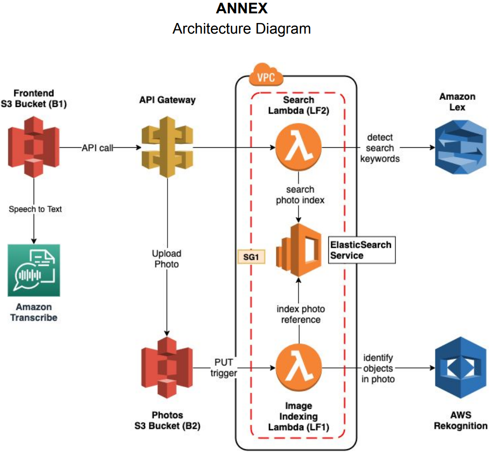

# Summary

The smart photo album is a AWS based serverless cloud application that allows users to upload photos and then search them using voice or text.

  >Users use the frontend up upload images into a S3 Bucket, and provide search queries based on image chracteristics.
  
  >The lambda functions then tag the images using Rekognition and the search query is passed through to Lex/Transcribe and the request is processed through another lambda function where ES search the labels generated. 
  
  >AWS services used: S3, API Gateway, Lambda, Lex, Elastic Search, Rekognition, Transcribe, 
    
- Architecture Diagram

